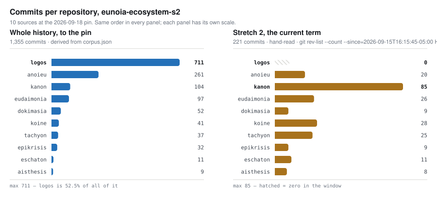

# eunoia-ecosystem-s2 — history report

**Run date** 2026-09-18. **Tool version** 0.1.0-demo. Stage 5 output: this file is prose and is not re-derivable. `corpus.json`, `events.jsonl`, `claims.jsonl`, `delta.json`, `ratio.json` and `panel.json` are, and are the only source of derived fact used here. Where a figure is **hand-read** it is marked in place, every time, with the command that produces it.

> [!IMPORTANT]
> **This is a self-assessment.** `corpus.json` carries `"self": true`. Under the
> [report requirements](../../../docs/judgement.md) its conclusions are never cited
> outward: not as evidence that these practices work, not in a vision document,
> not in a README. The subject contains the tool that produced it, and the tool is
> assessed here with everything else.

**Why this subject exists.** `eunoia-ecosystem-s2` is the first subject whose source list is **derived from the register rather than hand-written** — every entry in `kanon scripts/ecosystem/ecosystem.json` whose `status` is `member` or `president`. The two existing ecosystem subjects hand-write five and seven sources against a register holding ten, which both declare in `not_in_corpus` and neither fixes. Q6 reports what that difference is worth, and it is not what the declaration implies.

**Sources and commit counts** (committer date, `--date=short`, as git reports it): logos 711 (2026-03-03 → 2026-09-15); anoieu 261 (2026-08-29 → 2026-09-17); kanon 104 (2026-09-02 → 2026-09-18); eudaimonia 97 (2026-08-29 → 2026-09-18); dokimasia 52 (2026-08-30 → 2026-09-17); koine 41 (2026-08-31 → 2026-09-17); tachyon 37 (2026-09-14 → 2026-09-17); epikrisis 32 (2026-09-01 → 2026-09-17); eschaton 11 (2026-09-16 → 2026-09-17); aisthesis 9 (2026-09-14 → 2026-09-17). **1,355 commits, of which 711 — 52.5% — are one source.** Excluded paths: `deps/`, `checkers/`, `.lake/`.

**Declared thresholds**, absolute, with `thresholds_changed_after_events` = `false`: `prefix_depth` 1, `min_commits_prefix` 3, `rewrite_churn_ratio` 1.0, `rewrite_window_days` 7, `quiet_median_multiple` 6.0, `quiet_min_days` 3, `governance_lines` 40, `transplant_min_files` 3, `delta_lag_days` 7.

**Not in the corpus** — stated here and expanded in Q6: (1) **ethos**, a candidate rather than a member and somebody else's tree, which holds the proof checker and the compiler and is the one tree in this family with a sustained agent-disclosure practice; (2) **any window** — this tool reports over whole histories up to the pin and has no `--since`, so every stretch-scoped figure below is hand-read and marked; (3) **child projects are not sources** — each is read inside its parent at the parent's pin, so a child that changed parents appears as a directory arriving and a directory leaving and never as one event; (4) issue trackers, pull requests and discussion threads, for every source, by design; (5) anything unpublished, absolutely.

**Questions** are `questions.md`, pre-registered, digest recorded in the manifest and unchanged by this run. This report answers Q1–Q8 and nothing else.

---

## Q1. What were the major events?

**2026-03-03 — logos begins, and is alone for 179 days.** The first source enters at logos-repo-added-0099. Nothing else in this corpus exists until 2026-08-29.

**2026-08-29 → 09-02 — six trees appear in five days.** anoieu-repo-added-0106 and eudaimonia-repo-added-0021 on 08-29, dokimasia-repo-added-0018 on 08-30, koine-repo-added-0044 on 08-31, epikrisis-repo-added-0020 on 09-01, kanon-repo-added-0089 on 09-02. The `days_after_first_source` measure on each reads 179 to 183.

**2026-08-27 → 09-02 — the first restructuring.** logos-transplant-0001 moves 19 files; anoieu-transplant-0001 and -0002 move nine each on 08-31 and -0003 eight on 09-02.

**2026-09-01/02 → 09-14/16 — every tree then in existence stops at once.** Seven quiet candidates fire with the same shape: logos-quiet-0032 (13 days), anoieu-quiet-0063 (12), eudaimonia-quiet-0011 (12), epikrisis-quiet-0017 (12), kanon-quiet-0052 (12), dokimasia-quiet-0015 (14), koine-quiet-0020 (15). Each records a median inter-commit gap of 1 to 1.5 days against a gap of twelve or more. **Nothing in the declared record accounts for it**; see Q2.

**2026-09-14 → 09-16 — three more trees, inside 48 hours of the resumption.** aisthesis-repo-added-0006 and tachyon-repo-added-0032 on 09-14, eschaton-repo-added-0009 on 09-16. Repository count goes from seven to ten, a 43% increase, in the last four days of the corpus.

**2026-09-15 — governance leaves anoieu.** anoieu-transplant-0004 (15 files) and anoieu-transplant-0005 (4 files) on the same day; five child projects change parent from anoieu to kanon in the register on the same date (eco-status-change-0025 through eco-status-change-0029). The registry file itself moves trees.

**2026-09-15 16:15:45 −05:00 — Stretch 2 opens**, at kanon `7eb9973`, the commit in which the register first reads `status: president` against kanon. **This is hand-read.** No detector in this catalogue emits a stretch boundary, and the subject's own `anoieu.json` has said since 2026-09-01 that a stretch boundary "looks from outside like an ordinary commit touching a documentation file." It does, and it still does. *Re-derive:* `git -C kanon log -S'"status": "president"' -- scripts/ecosystem/ecosystem.json`.

**2026-09-16 → 09-17 — three tools join, one of them on the day it was created.** eco-joined-0038 records tachyon at `days_after_first_commit` 2; eco-joined-0040 records eschaton at **0**; eco-joined-0050 records aisthesis at 3. The earlier cohort has no `joined` event at all, for a reason that is a finding about the tool and is in Q6.

**2026-09-16 → 09-17 — child projects change parents four times in two days.** telos moves dokimasia → eschaton (eco-status-change-0036); martyria and zetesis move kanon → epikrisis (eco-status-change-0046, eco-status-change-0047) having moved anoieu → kanon two days earlier (eco-status-change-0027, eco-status-change-0028).

**2026-09-17 — three prefixes stop.** kanon-death-0010 after 28 commits, epikrisis-death-0011 after 11, koine-death-0011 after 7. All three are inside Stretch 2.

### The census: commits per repository

**The figure this run was asked for.** The whole-history column is derived — it is `corpus.json`. **The Stretch 2 column is hand-read and is not a product of this pipeline**, because the pipeline has no window; it is `git rev-list --count --since=2026-09-15T16:15:45-05:00 HEAD` in each checkout, at the same commits `corpus.json` pins.

<picture>
  <source media="(prefers-color-scheme: dark)" srcset="census-dark.svg">
  
</picture>

*Rendered by `figures` from `corpus.json` and [`figures.json`](figures.json), which declares the hand-read panel with the command that produces it. Blue is derived, ochre is hand-read, hatched is a zero.*

| repository | whole history | Stretch 2 *(hand-read)* | share of stretch |
| --- | ---: | ---: | ---: |
| logos | 711 | **0** | 0% |
| anoieu | 261 | 20 | 9% |
| kanon | 104 | **85** | **38%** |
| eudaimonia | 97 | 26 | 12% |
| dokimasia | 52 | 9 | 4% |
| koine | 41 | 28 | 13% |
| tachyon | 37 | 25 | 11% |
| epikrisis | 32 | 9 | 4% |
| eschaton | 11 | 11 | 5% |
| aisthesis | 9 | 8 | 4% |
| **total** | **1,355** | **221** | |

**Two facts are visible only when the columns are read together.** The tree holding 52.5% of the ecosystem's entire recorded history contributed **nothing** to the current stretch — logos's last commit, `be479120`, lands 2026-09-15T11:21:05, four hours and fifty-four minutes before the term opened. And the tree holding the governance is the busiest tree in the stretch by a factor of three.

**How many of these commits are believed AI-generated: not measurable, by anybody, including this tool.** What is measurable is disclosure, and it is reported beside the figure every time it is asked for. Three sources have ever disclosed an agent co-author: anoieu-ai-attribution-0064 (2026-08-30), epikrisis-ai-attribution-0018 and eudaimonia-ai-attribution-0012 (both 2026-09-02). **Five commits out of 1,355 — 0.37%.** Of the 221 commits in Stretch 2, **zero carry an agent trailer**, in any of the ten trees. The same is true of ethos in the same window, which is outside this corpus and has 22 such commits in its history. A trailer is opt-in, so the floor is zero and there is no ceiling; a tree with none is indistinguishable from a tree where none was recorded. *Re-derive:* the detector's own test — the **name** field of a `Co-authored-by:` trailer against the family list, never the address, and never a grep for the trailer, which over-counts.

## Q2. Does the tree show events no document mentions?

**The twelve-day stop is the largest derived-not-declared finding in this run, and nothing in 169 extracted claims addresses it.** Seven trees, seven independent `quiet` candidates, one window. `delta.json` classes 538 candidates as derived-only against 161 declared-only; all seven quiet candidates are in the derived-only set. A pause of this shape in seven repositories at once has one cause outside all seven of them, and the corpus cannot name it — the corpus is git history on disk, and whatever coordinated those trees left no commit.

**Membership now precedes substance, and no document says so.** eco-joined-0040 records eschaton entering the register as a member on the day of its first commit, with eleven commits to its name at the pin. The trees admitted in the first cohort carried between 10 and 707 commits when this corpus first sees them. Nothing in the declared record marks the change in threshold; it is visible only as an arithmetic drift across three `joined` candidates, which is the smallest population any finding here rests on.

**Child projects are churning between parents faster than any document tracks.** Eight parent changes in three days (eco-status-change-0025 through eco-status-change-0047), two of which move the same two projects twice. C0004 records one such fold in prose and carries no date, so `delta` cannot place it on a timeline; 80 of the 169 claims are undated and fall to declared-only for the same reason.

## Q3. Does the declared record claim events the tree does not show?

**The delta is void for a third time, and this time the void is louder.** `delta.json` reports 14 matched and 8 disagreeing — the largest match count this tool has produced, against 1 and 6 in the five earlier runs. **All fourteen are word collisions, and they were read one by one.** C0019, a topic titled *we are going to stop proving our report by re-running our tools*, matched seven separate candidates whose only connection to it is that they touch a prefix named `tools`. C0157, *the scripts we will host*, matched three candidates under `scripts`. koine-birth-0007, the appearance of a prefix named `koine`, matched three claims whose titles contain the word *koine*. Not one match is an event a claim describes.

**The void grew with the corpus.** The two earlier subjects produced 1 and 6 collisions; ten sources produce 14. The matcher's wrongness scales with the number of prefixes whose names are also common words in the documents, and this family names its directories after the things it writes about. A third void was recorded in advance as the expected outcome and it is the outcome; what was not predicted is that the count would rise and read, to anybody who does not open the file, as the matcher improving.

**So the 161 declared-only claims carry almost no information.** 89 of 169 claims carry a date, 80 cannot be placed on a timeline at all, and the 14 that crossed the join did so by accident. The honest reading is that the matcher cannot reach these claims, not that they are false.

**One claim class is true of work the corpus cannot see.** The claims extracted from kanon (29) and anoieu (20) describe an office, its laws and its discussion channel. A governance act in this family is one entry moving between two headings in a markdown file, and **the `governance` detector does not read the files it happens in**: across 1,355 commits it emitted 75 candidates over exactly twelve source/path pairs, none of which is `laws.md`, `history.md`, `board.md`, `discussion.md`, `glossary.md` or `protocols.md`. So a claim about those documents is declared-only by construction. That is a fact about the instrument and is carried into Q6 rather than reported as a discrepancy in the record.

## Q4. What has the evolution done well?

**The record moved with the office, and was kept during the term rather than written after it.** The term record in kanon carries 26 revisions between 2026-09-16 09:50 and 2026-09-17 16:58, on both full days the term has run — the first landing 17 hours 35 minutes after the office moved. The stated intent (C0144) was to keep it current rather than reconstruct it, and on the only measure a tree can carry — revision spacing — it has been. **Hand-read:**

```sh
git -C kanon log --since='2026-09-15T16:15:45-05:00' -- docs/history.md
```


**A self-imposed, falsifiable measure was written down before the work it constrains, and it can be settled.** The office was accepted with the measure *at the close of Stretch 2, `docs/` must not have grown relative to the code it governs*, against a baseline recorded in place: anoieu `579aae7`, markdown against Python. That baseline re-derives exactly — 1,503 KiB markdown against 581 KiB Python, ratio 2.59, `docs/` alone at 1,066 KiB. **Hand-read**, because this tool's `ratio` has no window and reports per month rather than between two named commits.

**Interim reading, and the stretch has not closed.** Following the documents rather than the tree they left — anoieu and kanon together, since the governance moved between them mid-measure — markdown against Python is **2.59 → 2.19**, and `docs/` against Python is **1.83 → 1.63**. The measure is currently being met. **The margin does not come from restraint:** `docs/` grew in absolute terms, 1,066 KiB → 1,107 KiB, and the ratio fell because Python grew faster, 581 KiB → 681 KiB. Read against anoieu alone the same measure reads 2.59 → 1.03, which is not restraint either — it is the documents having left the tree.

**Retirement is executed rather than deferred.** Five `death` candidates, three of them inside the current stretch (kanon-death-0010, epikrisis-death-0011, koine-death-0011), against 67 `birth` candidates. C0050 makes the same observation about logos from inside the family, and the derived record agrees with it here.

## Q5. What has it done badly?

**The instrument for noticing that a record has drifted from a tree was itself sixteen days stale, and its source list was three repositories short of the register it reads.** The newest ecosystem run before this one is dated 2026-09-02. Between then and this pin, three repositories were created and admitted, five child projects changed parents, the register moved trees and the office changed hands. Both existing ecosystem subjects declare the gap in `not_in_corpus`; a declared narrowness still produces a number a reader takes for the whole.

**And the gap is four times larger on the thing being measured than on the thing being declared.** A run using the seven-source subject reports 1,298 of 1,355 commits — 4.2% short — which is the figure the declaration implies. Over Stretch 2 the same subject reports **177 of 221, 19.9% short**, because the three unread trees are the three newest. **A stale source list under-reports exactly what is new, and the whole-history view hides it.** *Hand-read*, and it is the clearest measurable cost of the defect this run exists against.

**The governance detector is blind to the ecosystem's governance.** Twelve source/path pairs across 1,355 commits, matching a filename list compiled into the tool — `policy`, `roles`, `vision`, `names`, `proposals`. kanon carries fourteen markdown files under `docs/`; the detector sees three of them. The documents that decide who holds the office, what the laws are and what crosses to the next term are not among them. This was recorded as an open defect after it landed on two documents; it has since landed on an entire tree.

**The register's own history was truncated by the event it exists to record.** `detect_inventory` read 22 revisions, 0 unreadable, and emitted 29 `listed` candidates dated **2026-09-15** carrying `at_inventory_start: true` — because the register was created in kanon that day by the governance handoff, and its history in anoieu is in a tree the detector does not follow. The visible consequence is that only three `joined` candidates exist in a ten-member ecosystem, and the seven earlier members appear to have materialised on one afternoon. **The transition record was destroyed, as a record, by a transition.**

**Result data is counted as prose.** `ratio` reports tachyon at 1,098:1, prose to tool, on 1,805,306 prose lines. Those lines are benchmark gap-sets under `tools/heuresis/ledger/data/`, `.txt` by extension and product by intent. Separating them moves tachyon to 1.6:1 and the stretch-wide figure to 2.2:1 against a reported 99% prose share. The classifier is declared rather than inferred and its list is published, so this is predictable from the list — but no run before this one contained a tree that ships measurement data, and the number was wrong the first time one did.

**Three defects in the run machinery, all found by running it.** `pin --date` writes the run stamp into the `pinned` field, so any labelled stamp makes `panel` raise `ValueError` — reproduced on the pre-existing `eunoia-ecosystem/2026-09-02-census` run, and true of six of the twelve runs in this repository. `--date` is accepted by every stage and honoured only by `pin`, so a later stage silently writes into whatever directory sorts last. And "newest run" is `sorted()[-1]`, which is lexicographic: for anoieu it resolves to `2026-09-02b`, not to the most recent run. The `--run` half of that last defect was found and fixed on 2026-09-02; the `--date` half was left.

## Q6. What can this tool not see, and does that make Q1–Q5 unsafe?

**It cannot see a window, which is the question it was asked.** Every stretch-scoped figure in this report — the census column, the prose-to-code measure, the disclosure count, the `history.md` revision spacing — is hand-read with `git`, marked in place, and produced by the pipeline in no part. **The census this subject exists to deliver is currently a hand count with a tool-shaped run directory around it.** Q1's whole-history column is derived; the column anybody actually asked for is not.

**It cannot see ethos**, which is outside the member set and outside this corpus, holds one of the two executable artifacts this family is built around, and is the only tree here with a sustained disclosure practice — 22 commits since 2026-05-11. Every sentence in this report of the form *across the ecosystem* excludes it.

**It cannot see the governance layer**, for the reason given in Q5, in a family whose principal activity is governance.

**It cannot see a stretch boundary or a role changing hands.** Both were declared un-seeable by the subject before this run existed, and both remain so. The second is stated by the subject to be among the largest things that can happen here.

**It cannot see issue trackers, pull requests or discussion threads**, for any source, by design — the largest single thing absent, and the place where the coordination behind the twelve-day stop would be if it is anywhere.

**Does this make Q1–Q5 unsafe?** Q1's derived column, Q2's quiet cluster and Q5's arithmetic rest on commit counts and dates, which are the strongest thing here and are re-derivable at the pin. **Q3 is unsafe and is a report on the matcher rather than on the record**: 80 of 169 claims are undated, the governance documents are unreadable, and all 14 matches are collisions, so a declared-only classification in this family carries almost no information. **Q4's positive findings are the least safe in the report** — they are self-assessment, they rest on a hand-read measure whose baseline sits in a tree the measured documents have since left, and the stretch has not closed. They are stated as interim and are not a verdict.

## Q7. Is this one process or several?

**Two, and the boundary is sharp.** logos is 711 of 1,355 commits over 196 days, with two core rewrites and two prefix retirements in its history, and it has been silent for the whole of the current stretch. The other nine trees hold 644 commits over 20 days. On the panel, logos's prefixes carry median gaps of 3 to 61 days; every other tree's sit at 1 to 3.

**But the nine are not nine processes — they are one, and the twelve-day stop proves it.** Seven trees, each with a median inter-commit gap of about a day, stopped within 24 hours of each other and resumed within 48 hours of each other. Independent projects do not do that. The ecosystem, as this corpus sees it, is **one substantial artifact on its own clock, plus one hand moving across nine repositories on a single schedule** — and during Stretch 2 that hand spent 38% of its commits on the tree that governs the others and none at all on the artifact.

## Q8. Does the density of the declared record correspond to anything in the trees?

**In volume, yes, and the correspondence is the finding.** In Stretch 2, hand-read, the ten trees changed **81,043 lines of prose against 37,003 lines of code**, a ratio of 2.2:1, with result data separated out. kanon alone accounts for 42,339 prose lines — **52% of all prose written in the stretch**, from 38% of its commits. Two trees (aisthesis, eschaton) are prose at 44:1 and 145:1 and are documents with a repository around them; two (dokimasia, koine) are code-heavy at 0.3:1 and 0.7:1.

**In matchability, no — and the measured join is zero.** 169 claims were extracted from ten trees; 80 cannot be placed on a timeline at all; 14 matched a candidate and all 14 are word collisions on a prefix name (Q3). The record is dense, the tree is dense, and **nothing this run can compute joins them.** A record that cannot be joined to the tree it describes is not evidence that the tree was described, and this run cannot distinguish a faithful record the matcher cannot read from an unfaithful one. That is the same answer the two earlier ecosystem runs gave, on a corpus twice the size.

---

**On completeness.** The evidence here is not complete and cannot be. The largest absences are issue trackers, pull requests and discussion threads, for every source; ethos, entirely; the governance documents this family mostly consists of; and any window at all, which is the shape of the question this run was given. Nothing above should be read as covering what those contain.
