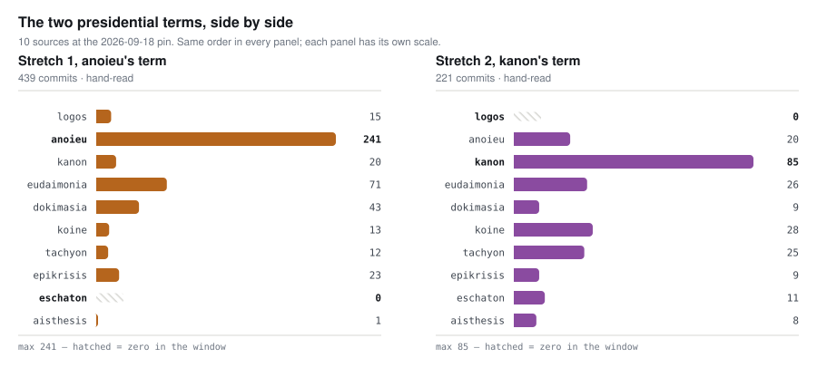

# Two presidencies, in commits

The **Eunoia ecosystem** is a group of repositories built around one proof
calculus. One of them holds an office called the *presidency* for a stretch of
time, sets the direction of the shared work, and hands it on. **Two stretches
have now run.** This page is what the git histories say about them — how much
was done, where, and when — at a single pinned moment, **2026-09-18**.

| | |
| --- | --- |
| **Stretch 1** | anoieu's term · 2026-08-29 → 2026-09-15 16:15:45 −05:00 · eighteen days |
| **Stretch 2** | kanon's term · opened 2026-09-15 16:15:45 −05:00 · **still running** |
| **Counted** | the ten repositories the ecosystem's register holds under its policy |

<b>439</b>commits in Stretch 1, across eighteen calendar days<i>Stretch 1</i>

<b>221</b>commits in Stretch 2 so far, across four<i>Stretch 2</i>

<b>11</b>of Stretch 1&rsquo;s eighteen days carried no commit anywhere<i>the finding below</i>

<b>49</b>commits of Stretch 1 fall outside the window its own record publishes<i>never reported</i>

<picture>
  <source media="(prefers-color-scheme: dark)" srcset="stretches-dark.svg">
  
</picture>

| repository | what it is | whole history | **Stretch 1** | **Stretch 2** |
| --- | --- | ---: | ---: | ---: |
| logos | the Lean development, and the calculus itself | 711 | 15 | **0** |
| anoieu | static analyzer, fuzzer, policy checker · *president in Stretch 1* | 261 | **241** | 20 |
| kanon | the ecosystem's policy, laws and register · *president in Stretch 2* | 104 | 20 | **85** |
| eudaimonia | the calculus template | 97 | 71 | 26 |
| dokimasia | finds gaps in cvc5's proof production | 52 | 43 | 9 |
| koine | shared tooling and the bug database | 41 | 13 | 28 |
| tachyon | searches for cvc5 performance improvements | 37 | 12 | 25 |
| epikrisis | audits these histories · *this tool* | 32 | 23 | 9 |
| eschaton | compares better-founded solver designs | 11 | 0 | 11 |
| aisthesis | writing about how this ecosystem develops | 9 | 1 | 8 |
| **total** | | **1,355** | **439** | **221** |

## Stretch 1 was idle for eleven of its eighteen days

| | Stretch 1 | Stretch 2 |
| --- | ---: | ---: |
| calendar days | 18 | 4 *(and counting)* |
| days with a commit anywhere | **7** | **4** |
| days with none | **11** | 0 |
| commits | 439 | 221 |
| per calendar day | 24.4 | 55.2 |
| **per active day** | **62.7** | **55.2** |

**Stretch 2 looks more than twice as busy as Stretch 1, and it is not.** Take the
idle days out of the denominator and the two terms run at the same pace — 62.7
commits per working day against 55.2, a difference of no consequence. What
separates them is that **Stretch 1 stopped**: work ran from 2026-08-29 to 09-02,
then nothing at all until 09-14.

**Seven repositories went quiet within a day of each other and resumed within
two**, in the middle of a term that was running throughout. Independent projects
do not do that, and nothing in the ecosystem's own written record accounts for
the gap. Anybody comparing the two terms on their headline rates would conclude
the second president doubled the pace of the ecosystem. **The evidence does not
support that.**

## There are two counts of Stretch 1, and this is why

**Anoieu, the president of Stretch 1, published a census of its own term — and it
covers five of the term's eighteen days.** Its term record carries a section
headed *the commit census, this stretch*, and the figures under it are for
**2026-08-29 to 2026-09-02**. The window is stated in the same sentence as the
numbers, which is the honest way to publish a partial count; it was simply never
extended once the rest of the term had happened.

So two different numbers are both correct, and they answer different questions:

| | window | commits | what it answers |
| --- | --- | ---: | --- |
| **the whole term** | 2026-08-29 → 09-15 | **439** | what happened during Stretch 1 |
| the published census | 2026-08-29 → 09-02 | 390 | what had happened by the day it was written |

**The gap is forty-nine commits, and this page is the first place the full-term
figure has appeared.** The published census is not wrong and is not misleading
about volume — it caught 89% of the term's commits, because the term's last
thirteen days were mostly the silence described above. It is a census named for a
stretch, written before two-thirds of the stretch had elapsed, and never revisited.

**One of its rows understates even its own window**, for a reason worth knowing
if you ever re-derive a figure like this. It reports 186 commits for anoieu; the
same window counted at this run's pin holds 217. The census was taken from a
commit made at **09:25 in the morning of its own closing day**, and 31 more
commits landed that afternoon. The same effect accounts for cvc5 at 8 against 10.
Nothing was rewritten — a census taken mid-morning on its last day simply misses
the rest of the day.

## The president's own tree is always the busiest

| | president | its own tree's share of its own term |
| --- | --- | ---: |
| Stretch 1 | anoieu | **241 of 439 — 55%** |
| Stretch 2 | kanon | **85 of 221 — 38%** |

**In both terms, the repository holding the office was the most active tree in
the ecosystem** — by a wide margin, and in neither case is it where the calculus
lives. The pattern survives a change of president, of repository, and of what the
office was for. It is two observations, and it is two observations of the same
thing.

## The tree all of this serves has stopped

**logos holds 711 of the 1,355 commits here — 52.5% of everything ever committed
across these repositories.** It contributed 15 commits to Stretch 1 and **none at
all** to Stretch 2; its last commit landed four hours and fifty-four minutes
before the second term opened.

Meanwhile the ecosystem grew. **eschaton, aisthesis and tachyon** hold 13 commits
across the whole of Stretch 1 and **44 of Stretch 2's 221** — a fifth of it. Two
of the three did not exist when the published census was taken.

## The two repositories this is all built on

**Neither `ethos` nor `cvc5` is a member of the Eunoia ecosystem, and both are
counted here**, because a sentence about what this work produced is wrong without
them. `cvc5` is the SMT solver everything here exists to serve; `ethos` holds the
proof checker and the Eunoia manual that every other reading of the language is
measured against. The ecosystem asks nothing of either.

| repository | footing | whole history | **Stretch 1** | **Stretch 2** |
| --- | --- | ---: | ---: | ---: |
| cvc5 | *foundation* — the arrangement is downstream of it | 14,093 | 22 | 7 |
| ethos | *candidate* — the policy is addressed to it, and it has not joined | 2,411 | 36 | 6 |

**They are counted and never assessed.** Nothing on this page or in any report
here judges them; a run whose subject is somebody else's tree would be a verdict
nobody asked for, and this project's own rules forbid publishing one. These rows
are context for the ecosystem's own figures.

**Two things about these numbers a reader should know before quoting them.**

**`ethos` gives a different answer depending on which branch you read, and nobody
has said which is the right one.** Counted on `ethosEoc3` — where the Eunoia
compiler work lives, and the branch the ecosystem's own register names for that
child project — it has **36** commits in Stretch 1 and 6 in Stretch 2. Counted on
`main` it has **5** and **0**. The table above uses `ethosEoc3`. Anoieu's census
used `main`, which is why it reported 3 where this page would have reported 34
for the same window. **Both are legitimate readings of the same repository**, an
order of magnitude apart, and the difference is a branch nobody thought to state.

**`cvc5` is not in the ecosystem's own checkout list.** `kanon`'s
`scripts/repos.local` records where every tracked repository lives on a machine
and has no entry for it, so no tool here resolves it automatically; the figures
above come from a local clone pinned at `a07d513075`. A repository the whole
arrangement is downstream of is the one the tooling cannot find.

## Where these numbers come from

**Every count is a `git rev-list` over a named window, taken at commits recorded
in advance**, so anybody with the checkouts can reproduce them exactly. The pins,
the windows and the commands are in
[`figures.json`](figures.json) and [`corpus.json`](corpus.json), and the chart
above is drawn from those files rather than typed.

**The dates are the subjects' own.** Stretch 1 is dated by anoieu's own term
record. Stretch 2 opens at kanon `7eb9973`, the commit in which the ecosystem's
register first records `status: president` against kanon.

**The windows are read by hand**, because this analyzer cannot do it. It reports
over whole histories up to a pin and takes no date range; that limitation is
[recorded as a defect](https://github.com/ajreynol/epikrisis/blob/main/history_analyzer/docs/notes.md).

## What this cannot settle

> [!IMPORTANT]
> **This is a self-assessment, and its conclusions do not travel.** Epikrisis is
> one of the ten repositories it is counting here. Under its own
> [report requirements](https://github.com/ajreynol/epikrisis/blob/main/history_analyzer/docs/judgement.md)
> nothing on this page may be cited as evidence that these practices work —
> a family grading itself with its own instrument produces something useful to
> the family and worth little to anybody else.

**Stretch 2 has not ended.** Every figure for it is four days of an unfinished
term. It is not a result.

**Commits are not work.** Every column counts landings. A repository can be
worked on for a week and land one commit, or land forty in an afternoon that
undo each other.

**`ethos` and `cvc5` are counted but are not part of any total.** The ecosystem
figures on this page cover the ten member repositories only. The two trees the
work is built on are reported separately, above, and never folded into a number
described as *the ecosystem*.

**Issue trackers, pull requests and discussion threads are not read**, for any
repository, by design — and that is where the explanation for an eleven-day idle
stretch would be, if it is written down anywhere.

---

**Going deeper.** [The full report for this run](report.md) answers eight
pre-registered questions against the same evidence.
[The case study](case-study.md) is about the instrument rather than the
ecosystem: what broke when this analysis was run, and what it cost.
[Every run](../../README.md) lists the committed evidence behind all of it.
