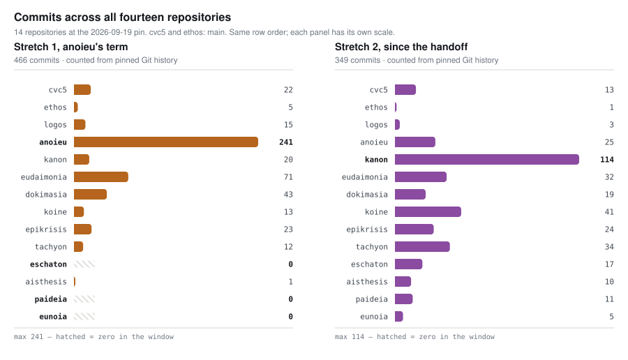

# Ecosystem census including eunoia and paideia

Snapshot: **2026-09-19**. This census covers **14 repositories** at published
`main` commits: the ten members in the pinned register, the explicitly requested
**eunoia** and **paideia** projects, and the separately tracked cvc5 and ethos.
Their histories contain **16,630 reachable commits**.

The history and LOC snapshots use the same commit for every repository.
Working-tree edits and untracked files are outside both analyses.

## The two added projects

| Repository | Commits | Implementation LOC | Documentation LOC | Pin |
| --- | ---: | ---: | ---: | --- |
| eunoia | 5 | 498 | 6,395 | [10edbf27194e](https://github.com/ajreynol/eunoia/commit/10edbf27194e48a1d2bca0da3924ad7d26fb449b) |
| paideia | 11 | 997 | 9,205 | [7ccb92d14df3](https://github.com/ajreynol/paideia/commit/7ccb92d14df3871d7ecaff3d1162810ce6564264) |

Eunoia studies the language and signature authoring; paideia documents cvc5
for developers. Under the LOC rules, documentation directories count only
as documentation; JSON and repository metadata are ignored. Recognized
examples, proof-language inputs and scripts outside those directories count
as implementation. The [LOC snapshot](https://ajreynol.github.io/epikrisis/loc/eunoia-ecosystem/2026-09-19/)
publishes the complete classification and file evidence.

Analysis coverage does not assign membership. At the kanon pin below, eunoia
is unlisted and paideia is recorded as a candidate. Both are included because
the maintainer requested them. The manifest records the register digest and
selection rule under `source_selection`.

## Commit census

Whole-history counts come from `corpus.json`. Window counts come from
`figures.json`, whose commands use committer timestamps and visit every
reachable commit. Stretch 1 ends at the recorded handoff; the next window
starts one second later, so no boundary commit is counted twice.

| Repository | Whole history | Stretch 1 | Since the handoff | Pin |
| --- | ---: | ---: | ---: | --- |
| aisthesis | 11 | 1 | 10 | [262c93d2c0ba](https://github.com/ajreynol/aisthesis/commit/262c93d2c0bab8b527ab65bc7b63e44ac40a3524) |
| anoieu | 266 | 241 | 25 | [06bd7872ea5c](https://github.com/ajreynol/anoieu/commit/06bd7872ea5ce24bf4d264bf5e6958ed8edee3c2) |
| cvc5 | 14,099 | 22 | 13 | [dbf176dfb71b](https://github.com/cvc5/cvc5/commit/dbf176dfb71b272ffbfdee06888dace73fee5aa8) |
| dokimasia | 62 | 43 | 19 | [1f88a99b81f4](https://github.com/ajreynol/dokimasia/commit/1f88a99b81f4416ffa8edd11f159fca3dd44c48d) |
| epikrisis | 47 | 23 | 24 | [19a98da4b462](https://github.com/ajreynol/epikrisis/commit/19a98da4b462985a1818fe9e43242797b2d1c632) |
| eschaton | 17 | 0 | 17 | [772923914e9e](https://github.com/ajreynol/eschaton/commit/772923914e9e4f62cc2744e203dba5c332d982fc) |
| ethos | 1,061 | 5 | 1 | [39f2f90c0c93](https://github.com/cvc5/ethos/commit/39f2f90c0c93b7b71e327c3c8e524b9da039d45b) |
| eudaimonia | 103 | 71 | 32 | [50532e03f620](https://github.com/ajreynol/eudaimonia/commit/50532e03f62052100df5eaf7361acec7fc8a1001) |
| eunoia | 5 | 0 | 5 | [10edbf27194e](https://github.com/ajreynol/eunoia/commit/10edbf27194e48a1d2bca0da3924ad7d26fb449b) |
| kanon | 134 | 20 | 114 | [8437526a14a7](https://github.com/ajreynol/kanon/commit/8437526a14a7fae0a0de16fbc5d90250b0cea2ed) |
| koine | 54 | 13 | 41 | [74ea664a222d](https://github.com/ajreynol/koine/commit/74ea664a222d962f45ba3fee8511e1e5ad93b4b8) |
| logos | 714 | 15 | 3 | [c8165b2afd32](https://github.com/cvc5/logos/commit/c8165b2afd321ce8d4b168c270b1fb53388e16da) |
| paideia | 11 | 0 | 11 | [7ccb92d14df3](https://github.com/ajreynol/paideia/commit/7ccb92d14df3871d7ecaff3d1162810ce6564264) |
| tachyon | 46 | 12 | 34 | [e68bcc1d53ea](https://github.com/ajreynol/tachyon/commit/e68bcc1d53ea6e36f1031fb9c875511858066839) |
| **Total** | **16,630** | **466** | **349** | |

The following commands reproduce each window at its recorded pin:

```sh
git rev-list --count --since-as-filter=2026-08-29T00:00:00-05:00 --until=2026-09-15T16:15:45-05:00 <pin>
git rev-list --count --since-as-filter=2026-09-15T16:15:46-05:00 --until=2026-09-19T13:23:23+00:00 <pin>
```

<picture>
  <source media="(prefers-color-scheme: dark)" srcset="overview-dark.svg">
  
</picture>

## Scope and evidence

The primary analysis corpus contains 12 repositories and 1,470 commits.
Its refreshed evidence has 655 candidate events and 177 declared claims,
plus the mechanical matches in the delta. The new projects are included
in those stages. Cvc5 and ethos supplement the census with main-branch
commit counts; their events and claims are not assessed here.

This is a quantitative census, with evidence stages 1–4 complete. It makes
no new assessments of the candidates. The [September 18 report](../2026-09-18/report.md)
retains its original ten-source scope and assessments. Repository-wide
counts do not isolate when imported child-project content was first written,
and commit or line counts measure neither effort nor quality.

[Pins and selection](corpus.json) · [Window counts and commands](figures.json) ·
[Candidate events](events.jsonl) · [Declared claims](claims.jsonl) · [Delta](delta.json).
